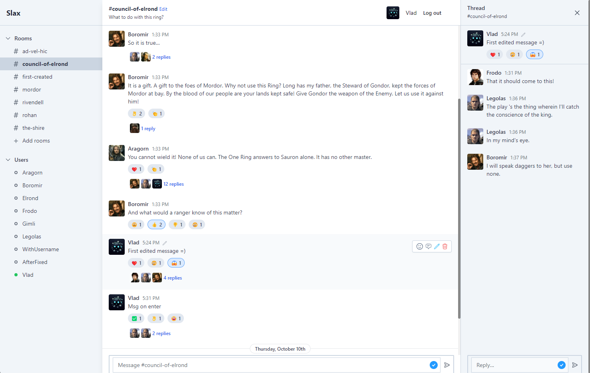

# Slax

[](https://shields.io/)
[](https://shields.io/)
[](https://shields.io/)
[](https://shields.io/)

This project is a simple version of Slack. Here you can log in, create and join rooms, send, edit and delete messages, post reactions and write threads.

### Tech Stack

- Framework: `Elixir with Phoenix LiveView`
- As Database: `PostgreSQL`

### Manual Setup

1. Open your local CLI:

   ```
   git clone https://github.com/Vlad-Makarenko/slax
   cd slax
   ```

2. Setup the project:

   ```
   mix setup
   ```

3. Start your Phoenix server:

   ```
   mix phx.server
   ```

   or inside IEx:

   ```
   iex -S mix phx.server
   ```

Now you can visit [`localhost:4000`](http://localhost:4000) from your browser.

## Demo

### chat page example


